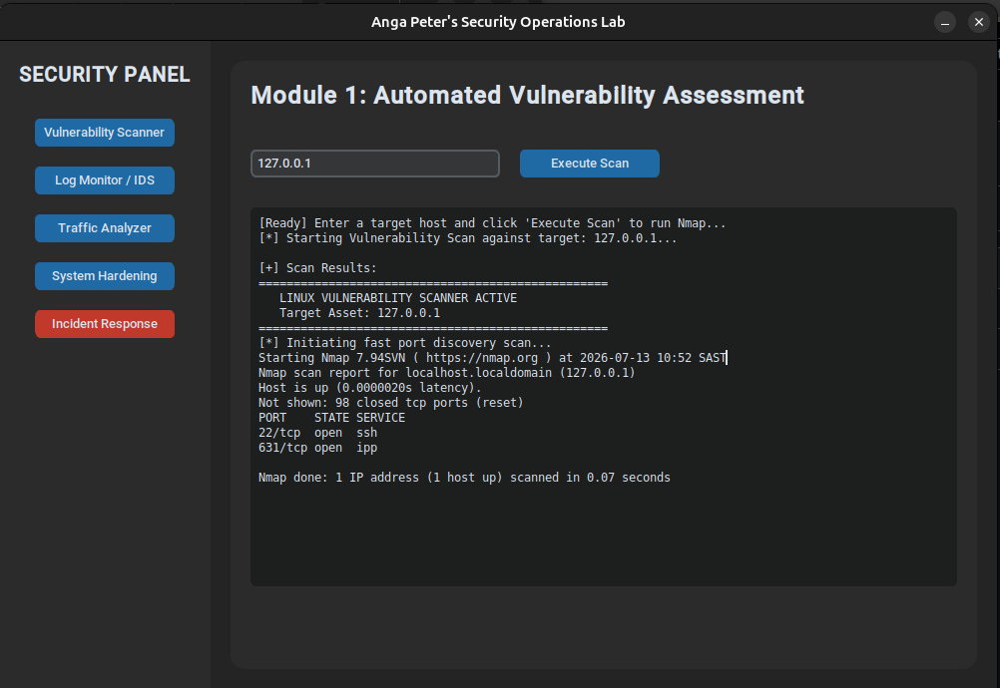
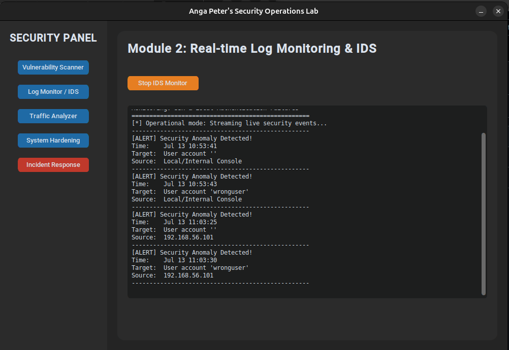
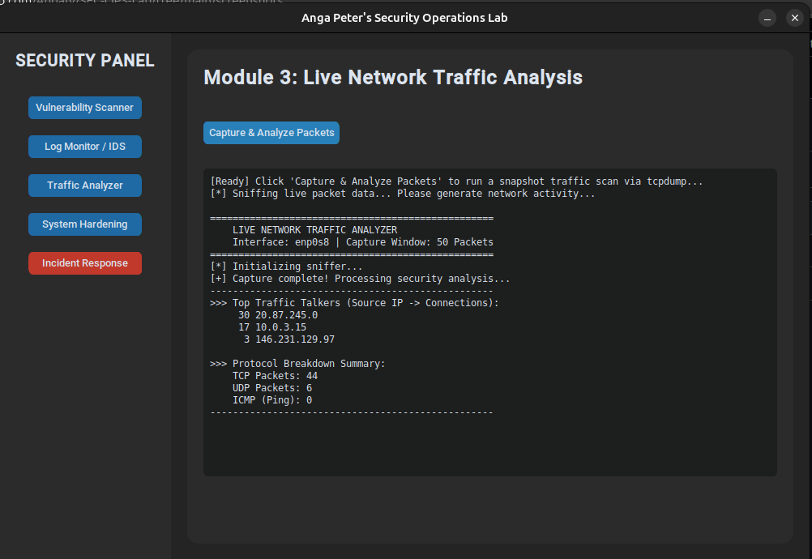
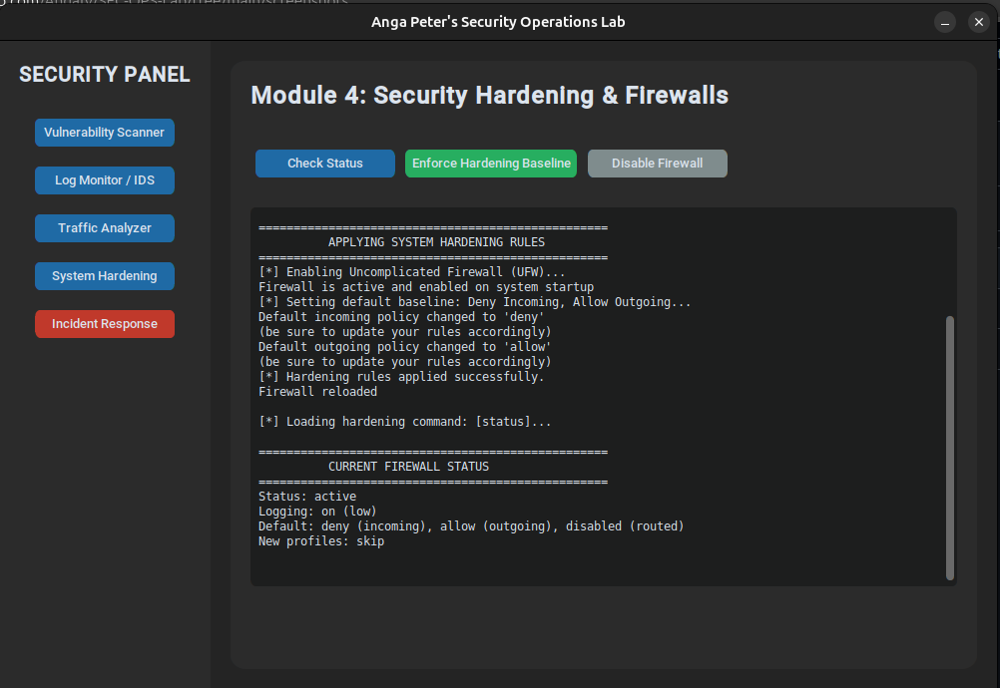
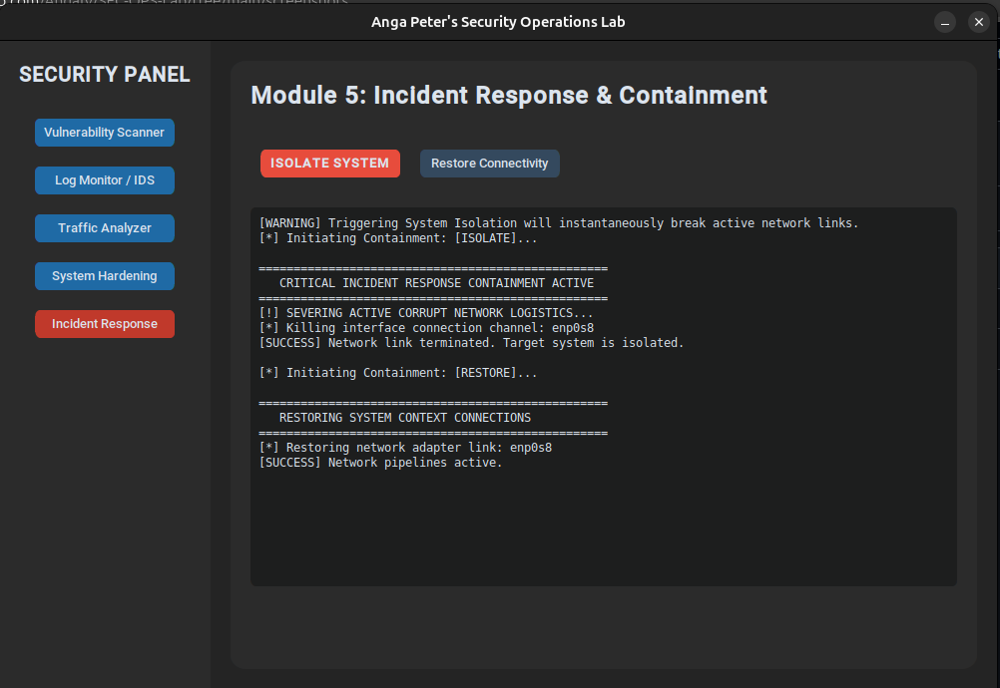

# SEC-OPS-Lab: Security Operations Lab
**Simple Security Operations, Network Traffic Sniffing, and Automated Containment**

---

## About the Project

A security operations control panel that connects a custom Python GUI with native Linux binaries. The system brings together core defensive capabilities such as vulnerability scanning, real-time log monitoring, packet analysis, firewall hardening, and network isolation in a single desktop interface for Linux.


---

## Core Components

| Component | Role |
|---|---|
| **Vulnerability Scanner** | Handles network footprinting sweeps using `nmap` to audit open ports and service banners. |
| **Log Monitor / IDS** | Parses `/var/log/auth.log` via a non-blocking asynchronous streaming worker to flag authentication failures instantly. |
| **Traffic Analyzer** | Utilizes a snapshot capture engine backed by `tcpdump` to extract connection tracking telemetry and flag traffic volume anomalies. |
| **System Hardening** | Interacts with the Uncomplicated Firewall `(ufw)` subsystem to enforce a default-deny inbound posture. |
| **Incident Response** | Functions as a network kill-switch to immediately isolate physical or virtual interface links during an active compromise. |

---

## Technical Architecture

A multi-threaded Python front-end built with customtkinter that launches asynchronous subprocesses to safely execute root-level system scripts.

```text
                           [ Security Operations Lab GUI ]
                                         │
        ┌───────────────┬────────────────┼───────────────┬───────────────┐
        ▼               ▼                ▼               ▼               ▼
   [ Module 1 ]    [ Module 2 ]     [ Module 3 ]    [ Module 4 ]    [ Module 5 ]
   Vuln Scanner    Log Monitor    Traffic Analyzer   Hardening    Incident Response
        │               │                │               │               │
        ▼               ▼                ▼               ▼               ▼
     (nmap)       (auth.log)        (tcpdump)          (ufw)        (ip link)
```
---

## Configuration and Implementation

### 1. Automated Vulnerability Assessment

The scanning engine performs non-destructive network scans against specified target hosts to map the attack surface and identify open ports:

```bash
nmap -sV -p- --open "$TARGET_IP" -oN "$SCAN_OUTPUT_FILE"
```

The application parses the output and displays live port information and detected services on the dashboard.



### 2. Multi-Threaded Real-Time Log Monitoring

To keep the GUI responsive while processing continuous log streams, the intrusion detection module runs in a background worker thread that continuously monitors system authentication logs:

```python
self.monitor_thread = threading.Thread(target=self.log_stream_worker, daemon=True)
self.monitor_thread.start()
```

The underlying script continuously tails ```/var/log/auth.log``` to detect and highlight authentication failures.



### 3. Snapshot Network Traffic Analysis

The traffic engine captures network packets over a fixed time window before performing statistical analysis to identify traffic spikes or unusually active hosts:

```bash
tcpdump -i "$INTERFACE" -c "$PACKET_COUNT" -nn -w "$CAPTURE_FILE" 2>/dev/null
```

The captured data is then parsed to extract protocols, source and destination IP addresses, and packet sizes.



### 4. Firewall Rule Hardening Execution

The hardening utility interacts with the Uncomplicated Firewall (ufw) to switch the local network between open and default-deny configurations:

```bash
sudo ufw default deny incoming && sudo ufw default allow outgoing && sudo ufw enable
```

Administrators can use the interface to safely and dynamically apply firewall rule changes.



### 5. Incident Containment Network Kill-Switch

When a host compromise is confirmed, the response engine disables the network interface to isolate the machine from the physical or virtual network:

```bash
sudo ip link set dev "$INTERFACE" down
```

This immediately disconnects the system from the network, preventing further communication and helping limit lateral movement.



---

## Skills Applied

- Python multi-threading and GUI orchestration `(customtkinter)`
- Asynchronous subprocess pipeline handling
- Network packet sniffing and traffic telemetry `(tcpdump)`
- Linux authentication auditing `(auth.log)`
- Netfilter firewall policy enforcement `(ufw)`
- Incident response containment and interface isolation
- Bash scripting engineering and structural directory handling
- Linux permission privilege structures (sudo execution context)

---

## Prerequisites

The control panel relies on system binaries that require root privileges. Ensure the following tools are installed on the host machine:

```bash
sudo apt update
sudo apt install nmap tcpdump ufw python3-pip python3-venv -y
```

---

## How to Replicate

### 1. Clone the Workspace
```bash
git clone git@github.com:AngaIV/SEC-OPS-Lab.git
cd SEC-OPS-Lab
```

### 2. Setup Isolated Environment
```bash
python3 -m venv env
source env/bin/activate
pip install customtkinter
```

### 3. Run the Control Panel
Because the application modifies network interfaces and firewall rules, run it with root privileges:
```bash
sudo ./env/bin/python main.py
```

### 4. Optional: Compile standalone Binary
```bash
pip install pyinstaller
pyinstaller --clean --onefile --collect-all customtkinter --add-data "scripts:scripts" main.py
```
